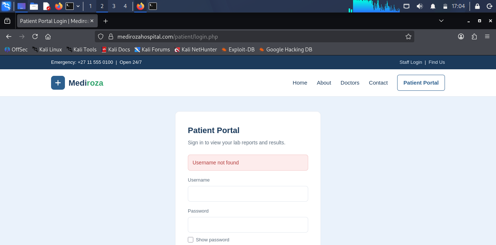
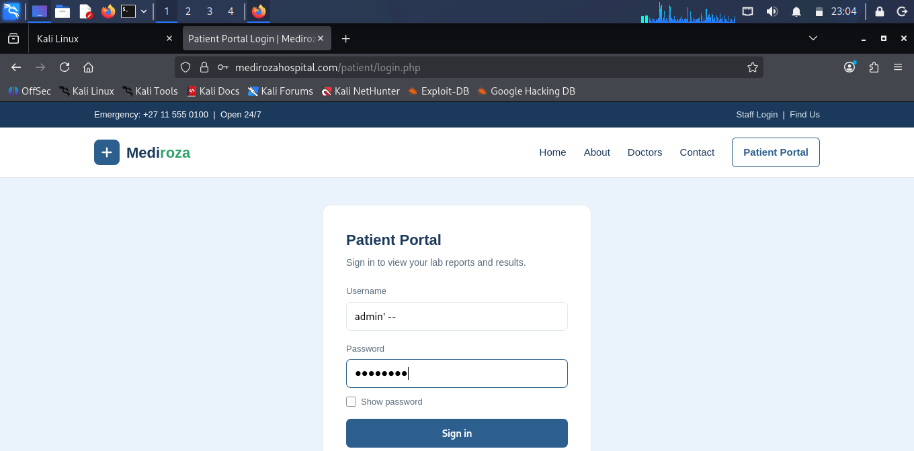
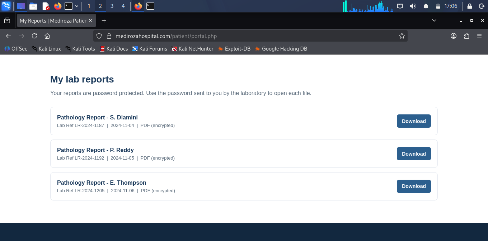
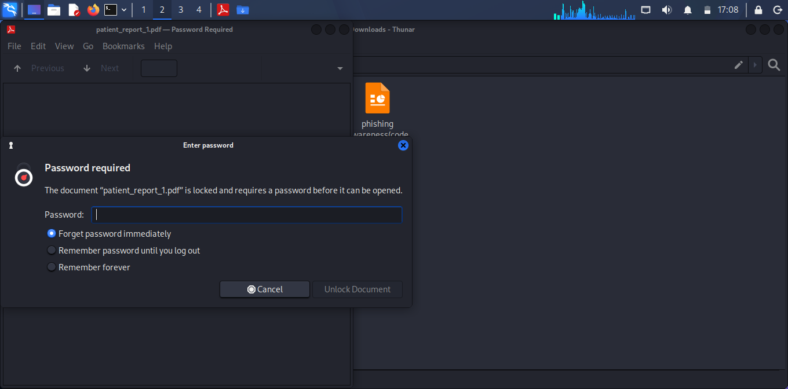
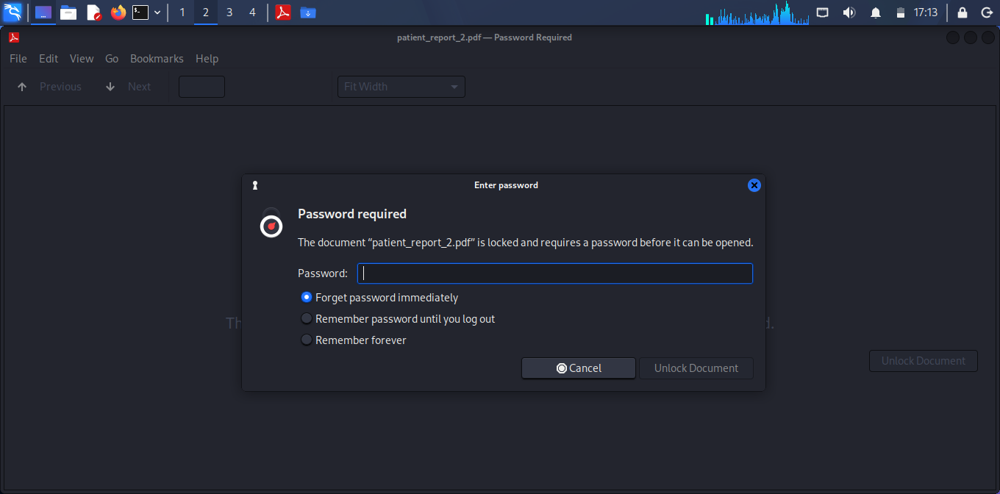
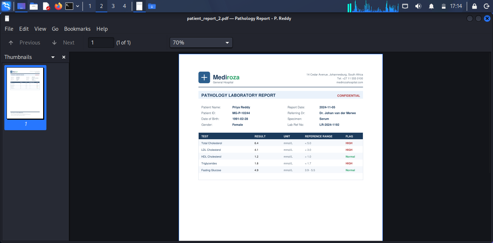
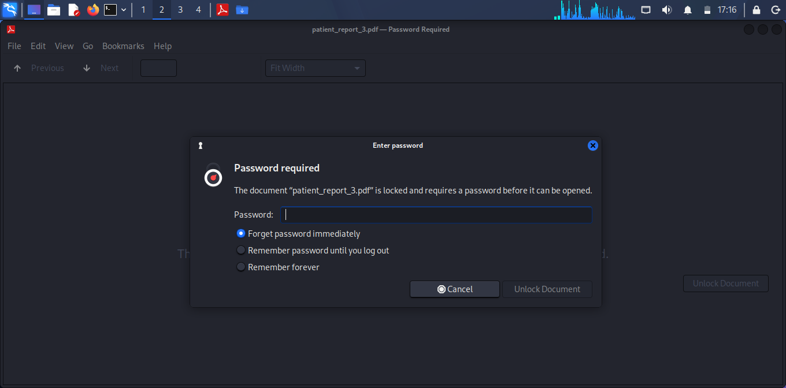
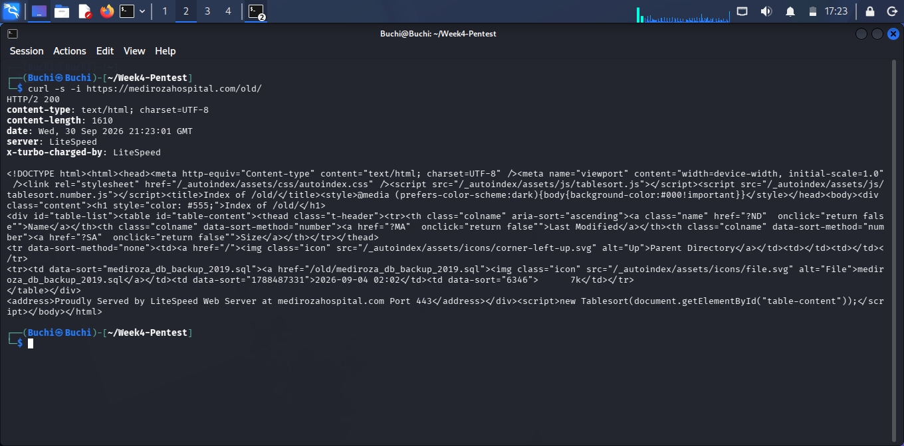
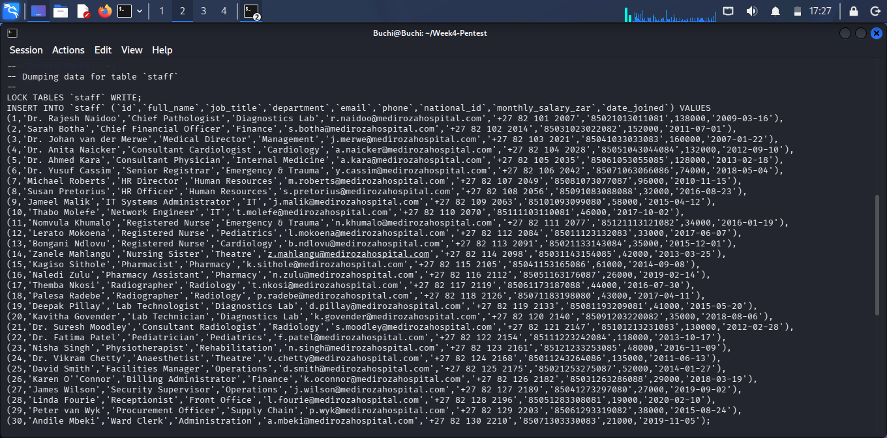
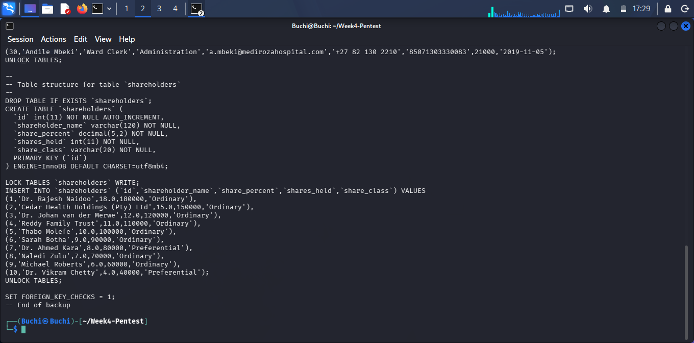

<div align="center">

# 🏥 Mediroza General Hospital
### Web Application Penetration Test

**Week 4 Penetration Testing Internship · Batch B083**

*Confidential Security Assessment — Authorized Educational Engagement*

[](#-milestone-results)
[](#-overall-risk-assessment)
[](#-scope--methodology)
[](#-assessment-disclaimer)

</div>

---

<p align="center">


</p>

---

> **Program:** NetworkWalks — Batch B083, Week 4 &nbsp;|&nbsp; **Client (simulated):** Mediroza General Hospital
> **Target:** [`https://medirozahospital.com`](https://medirozahospital.com)
> **Note:** This is a training engagement carried out against a purpose-built lab target under NetworkWalks' Week 4 project brief, with written permission granted for testing as documented in the project scope. The techniques documented here must never be applied to any system without explicit written authorization.

<p align="center">

---
## 🎯 Executive Summary

A controlled **black-box penetration test** was conducted against Mediroza General Hospital's web infrastructure as part of a Week 4 penetration testing internship assignment.

| | |
|---|---|
| 🌐 **Target** | `https://medirozahospital.com` |
| 🏢 **Client** | Mediroza General Hospital |
| 🧪 **Assessment Type** | Black-box Web Application Penetration Test |
| ⏱️ **Duration** | 5 days |
| ✅ **Authorization** | Explicitly authorized, educational scope only |
| 🚫 **Excluded** | Social engineering, denial-of-service |

### Objectives

1. Gain access to the restricted patient portal
2. Retrieve three confidential patient laboratory reports
3. Crack the encryption protecting all three reports
4. Identify exposed employee salary information
5. Identify exposed shareholder information
6. Document vulnerabilities, evidence, impact, and remediation

---

## ⚡ Headline Findings

| # | Finding | Severity | Endpoint |
|---|---|---|---|
| 1 | **SQL Injection — Authentication Bypass** (`admin' --`) → full account takeover with no valid password | 🔴 Critical | `POST /patient/login.php` |
| 2 | **Weak / Trivial PDF Passwords** protecting confidential pathology reports — all 3 cracked via dictionary attack | 🟠 High | Downloaded patient reports |
| 3 | **Username Enumeration** — login form confirms whether a username exists before checking the password | 🟡 Medium | `POST /patient/login.php` |
| 4 | **Directory Listing Enabled** on `/staff/` and `/old/`, exposing filenames directly | 🟠 High | `GET /staff/`, `GET /old/` |
| 5 | **Exposed Historical Database Backup** — `/old/mediroza_db_backup_2019.sql` publicly downloadable, containing staff PII and shareholder records | 🔴 Critical | `GET /old/mediroza_db_backup_2019.sql` |

---
## 🔍 Scope & Methodology

### Scope

**In scope:** public web app · authentication mechanisms · patient portal · staff portal · publicly accessible files/directories · input handling · accessible backups · retrieved PDFs · offline document analysis

**Out of scope:** social engineering · denial-of-service · systems outside the target domain · unrelated third-party infrastructure

### Testing Phases

```
Phase 1  Reconnaissance            → headers, sitemap, robots.txt, directory discovery
Phase 2  Authentication Analysis   → input validation, SQLi indicators, enumeration
Phase 3  Restricted Area Access    → SQL injection auth bypass → patient portal
Phase 4  Data Extraction           → 3 encrypted lab report PDFs retrieved
Phase 5  Offline Password Recovery → pdf2john → all 3 cracked
Phase 6  Further Exposure Analysis → /old/ backup discovery → HR & shareholder leak
```

---
## 🪜 Full Walkthrough

### Milestone 1 — Initial Access

**Step 1 — Command-line reconnaissance.** Before opening a browser, `curl` was used to fingerprint the stack with minimal footprint:


---

`robots.txt` was checked next — and it handed over far more than expected, explicitly disallowing `/patient/`, `/staff/`, and `/old/`:


---

This is effectively a self-authored map of the site's most sensitive areas, discovered before a single page was manually browsed. The `sitemap.xml` referenced at the bottom of `robots.txt` was checked too, but only listed the public marketing pages (`index`, `about`, `doctors`, `contact`) — confirming the sensitive paths were deliberately excluded from the "official" map rather than simply forgotten:


---

**Step 2 — Browser reconnaissance.** The `/patient/login.php` path flagged by `robots.txt` was opened directly in a browser:


---

**Step 3 — Baseline login test (username enumeration found).** A plausible-but-invalid username was submitted to observe normal application behavior, producing an explicit **"Username not found"** message — a secondary finding on its own, since the application validates username existence before checking the password:



---

**Step 4 — Manual confirmation & exploitation.** A single `'` reproduced a SQL syntax anomaly, confirming unsanitized input reaching the database layer.The classic authentication-bypass payload was then submitted as the username,with any value as the password:

---


---

```
Username: admin' --
Password: anything
```

**Step 5 — Impact: unauthorized data access.** The bypass succeeded, granting access to "My Reports" — three password-protected pathology reports:

---



This closes out **Milestone 1**: proof of unauthorized access, plus the 3 target PDF files.

---

### Milestone 2 — Cracking the Encryption

Each of the 3 downloaded PDFs opened with a password prompt, exactly as advertised on the portal itself ("Your reports are password protected"). Each file was treated as an independent target — the brief's own hint warned not to assume one approach would fit all three.

**`patient_report_1.pdf` — Sipho Dlamini**



---

A hash was extracted locally and run through a dictionary attack — cracked on the first attempt: **`123456`**.


---


**`patient_report_2.pdf` — Priya Reddy**

--



---

Cracked on the second attempt against the same built-in wordlist: **`password`**.

---



---


**`patient_report_3.pdf` — Emily Thompson**




---

Confirmed the brief's warning was well-founded — this password was neither `123456` nor `password`, but still fell to the same built-in dictionary: **`!@#$%^&`**.

---


---


| File | Patient | Password | Attempts |
|---|---|---|---|
| `patient_report_1.pdf` | Sipho Dlamini | `123456` | 1st |
| `patient_report_2.pdf` | Priya Reddy | `password` | 2nd |
| `patient_report_3.pdf` | Emily Thompson | `!@#$%^&` | Within built-in list |

All three files were fully decrypted using nothing more than a hash extractor and a 100-word built-in dictionary — no custom wordlist, no character-by-character brute-forcing. This satisfies **Milestone 2**.

---

### Milestone 3 — Critical Data Exposure (Staff Salaries & Shareholders)

Following the M3 brief to look beyond the obvious content, the `/staff/` and `/old/` paths flagged earlier by `robots.txt` were checked directly.

**`/staff/` — directory listing exposed.** Instead of a proper 403/404, the server returned a full directory listing, exposing `staff/login.php` by name:

---

**`/old/` — a far more serious exposure.** The same misconfiguration on `/old/` revealed a publicly downloadable historical database backup, `mediroza_db_backup_2019.sql`



---

The backup's own header comment flagged exactly what it contained — confidential staff and shareholder records:

---


---

The dump included full staff records — names, job titles, departments, contact details, national ID numbers, and **monthly salaries** for all 30 hospital employees:

---



---

...and a separate `shareholders` table listing ownership stakes in the hospital:



---

This satisfies **Milestone 3**: both required data points — staff salaries and shareholder details — were fully recovered, sourced from an unauthenticated, publicly accessible backup file rather than any further exploitation of the login form.

> ⚠️ **Handling note:** The dump contains real-format PII (national ID numbers, salaries, contact details). This should be redacted or excluded from any public-facing copy of this repository; it is retained here only as evidence for the training deliverable.


---

## ✅ Milestone Results

| Milestone | Description | Status |
|---|---|:---:|
| **M1** | Initial access — auth bypass & 3 lab reports retrieved | ✅ Complete |
| **M2** | Data extraction — encryption cracked on all 3 PDFs, decryption verified | ✅ Complete |
| **M3** | Critical data exposure — staff salary & shareholder data identified | ✅ Complete |
| **M4** | Professional penetration-testing report delivered | ✅ Complete |

```
M1 ████████████████████ 100% ✅
M2 ████████████████████ 100% ✅
M3 ████████████████████ 100% ✅
M4 ████████████████████ 100% ✅
```

---

## 📊 Risk Rating Summary

| Finding | Severity | Primary Impact |
|---|:---:|---|
| SQL Injection Auth Bypass | 🔴 Critical | Unauthorized access to restricted patient data |
| Public Database Backup | 🔴 Critical | Exposure of confidential HR/shareholder information |
| Weak PDF Password Protection | 🟠 High | Offline recovery of protected medical reports |
| SQL Error Disclosure | 🟡 Medium | Reveals database/query information |
| Username Enumeration | 🟢 Low | Enables account discovery |
| Directory Listing | 🟢 Low | Reveals application/server structure |

---

## ⚠️ Overall Risk Assessment

<div align="center">

### **Overall Rating: CRITICAL**

</div>

Multiple vulnerabilities chain together into two serious compromise paths:

**Path A — Patient Data**
```
Internet → Public Web App → Patient Login → SQL Injection
   → Authentication Bypass → Restricted Patient Portal
   → Confidential Lab Reports → Offline PDF Password Recovery
   → Medical Information Disclosure
```

**Path B — Internal Records**
```
Internet → /old/ → Public Directory Listing
   → mediroza_db_backup_2019.sql → Internal Database Records
   → Employee Info · Salaries · National IDs · Shareholder Data
```

---

## 🔧 Recommendations & Remediation

### Priority 1 — Immediate
- Fix SQL injection with parameterized queries throughout
- Remove `/old/mediroza_db_backup_2019.sql` from the public web root
- Disable directory indexing site-wide
- Investigate whether exposed data was accessed by unauthorized parties

### Priority 2 — High
- Strengthen patient authentication (secure hashing, MFA, rate limiting, lockout, CSRF protection)
- Replace static PDF passwords with strong secrets + application-level authorization
- Remove verbose database error disclosure from production

### Priority 3 — Medium / Low
- Generic authentication error messages (prevent enumeration)
- Reduce technology/version disclosure (`X-Powered-By`, `Server`, CMS version)
- Implement security monitoring (failed logins, SQLi patterns, backup access)
- Store backups outside the web root, encrypted, access-restricted, periodically audited

---

## 🔐 Evidence Handling & Privacy

Because this engagement involved real healthcare and HR data, evidence has been **sanitized for public release**. The following are intentionally excluded from this repository and retained only in a private submission:

```
patient_report_1.pdf / 2.pdf / 3.pdf
report1.txt / 2.txt / 3.txt
report1.hash / 2.hash / 3.hash
week4_db_backup.sql
Raw screenshots containing patient names, medical results, patient IDs,
passwords, session cookies, tokens, national IDs, or personal contact info
```

Recommended repo structure:

```
mediroza-week4-pentest/
├── README.md
├── evidence/
│   ├── m1-patient-portal-access.png
│   ├── m1-report-list.png
│   ├── m2-hashcat-report[1-3].png
│   ├── m2-report[1-3]-decryption.png
│   ├── m3-public-old-directory.png
│   ├── m3-database-structure.png
│   ├── m3-staff-exposure.png
│   └── m3-shareholder-exposure.png
└── methodology/
    └── testing-notes.md
```

---

## 💡 Lessons Learned

| # | Takeaway |
|---|---|
| 1 | Authentication must never trust client-supplied input |
| 2 | Verbose error messages are attacker intelligence, not just noise |
| 3 | `robots.txt` is not an access-control mechanism |
| 4 | Backups and legacy files are part of the attack surface |
| 5 | Encryption doesn't compensate for a weak password |
| 6 | Low-severity findings can chain into critical impact |

---

## 📦 Final Deliverables

| Deliverable | Status |
|---|:---:|
| Target reconnaissance | ✅ |
| Authentication analysis & bypass | ✅ |
| Patient portal access | ✅ |
| Three patient PDFs retrieved | ✅ |
| PDF hashes extracted & passwords recovered | ✅ |
| Three PDFs decrypted & verified | ✅ |
| Staff salary exposure identified | ✅ |
| Shareholder exposure identified | ✅ |
| Evidence collected (private) | ✅ |
| Risk ratings assigned | ✅ |
| Remediation recommendations | ✅ |
| Professional report | ✅ |

---

## 📄 Assessment Disclaimer

This penetration test was conducted as part of an **authorized educational security assessment**. The target was explicitly authorized for testing, and all activity was restricted to the agreed scope. No social engineering or denial-of-service testing was performed. All sensitive information has been redacted from this public report. This methodology and evidence are provided for authorized security assessment and educational purposes only.

---


