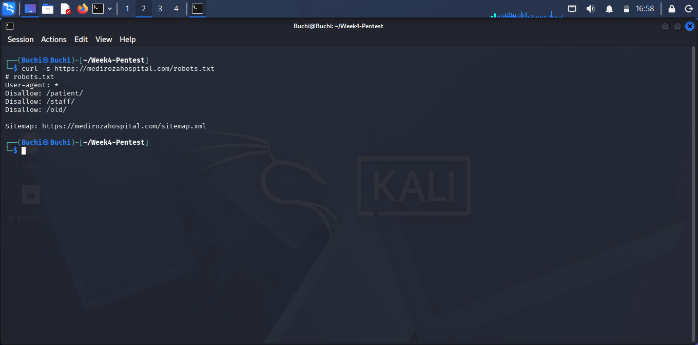
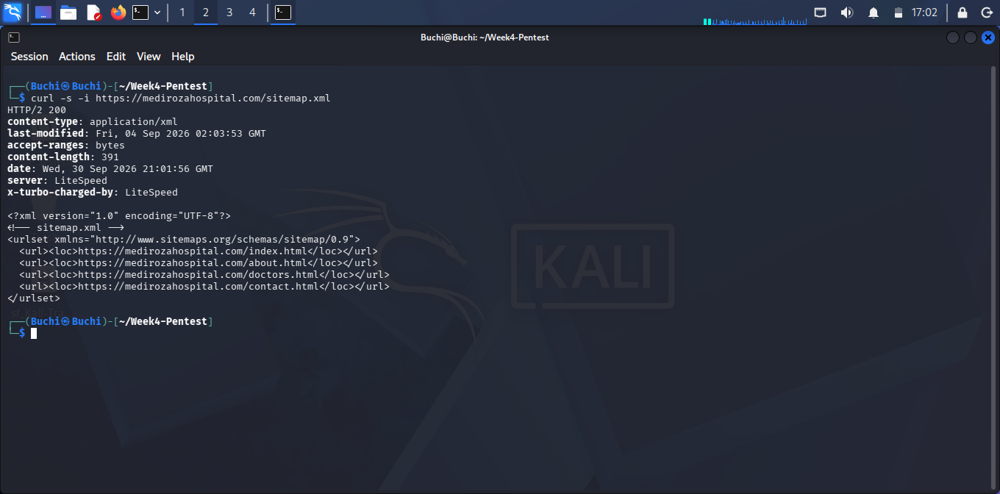
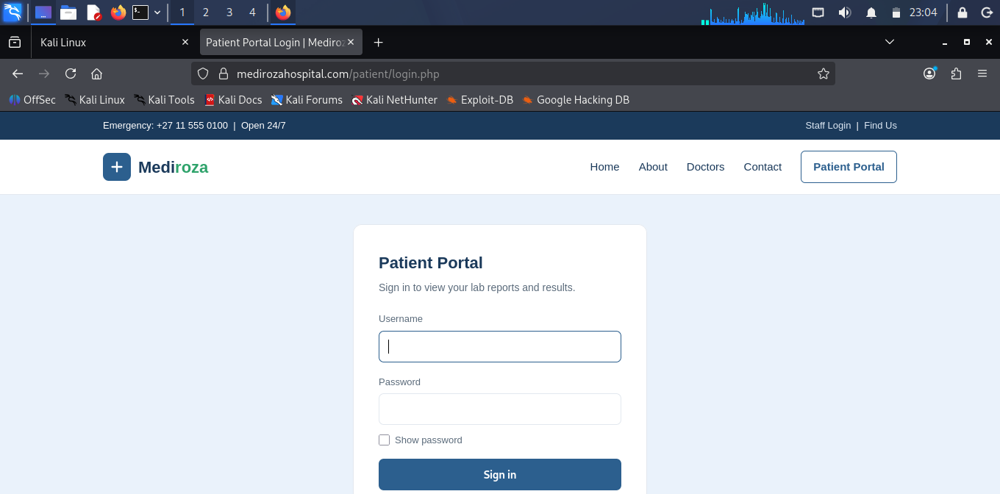

<div align="center">

# 🏥 Mediroza General Hospital
### Web Application Penetration Test

**Week 4 Penetration Testing Internship · Batch B083**

*Confidential Security Assessment — Authorized Educational Engagement*

[](#-milestone-results)
[](#-overall-risk-assessment)
[](#-scope--methodology)
[](#-assessment-disclaimer)

</div>

---

<p align="center">


</p>

---

> **Program:** NetworkWalks — Batch B083, Week 4 &nbsp;|&nbsp; **Client (simulated):** Mediroza General Hospital
> **Target:** [`https://medirozahospital.com`](https://medirozahospital.com)
> **Note:** This is a training engagement carried out against a purpose-built lab target under NetworkWalks' Week 4 project brief, with written permission granted for testing as documented in the project scope. The techniques documented here must never be applied to any system without explicit written authorization.

<p align="center">

---
## 🎯 Executive Summary

A controlled **black-box penetration test** was conducted against Mediroza General Hospital's web infrastructure as part of a Week 4 penetration testing internship assignment.

| | |
|---|---|
| 🌐 **Target** | `https://medirozahospital.com` |
| 🏢 **Client** | Mediroza General Hospital |
| 🧪 **Assessment Type** | Black-box Web Application Penetration Test |
| ⏱️ **Duration** | 5 days |
| ✅ **Authorization** | Explicitly authorized, educational scope only |
| 🚫 **Excluded** | Social engineering, denial-of-service |

### Objectives

1. Gain access to the restricted patient portal
2. Retrieve three confidential patient laboratory reports
3. Crack the encryption protecting all three reports
4. Identify exposed employee salary information
5. Identify exposed shareholder information
6. Document vulnerabilities, evidence, impact, and remediation

---

## ⚡ Headline Findings

| # | Finding | Severity | Endpoint |
|---|---|---|---|
| 1 | **SQL Injection — Authentication Bypass** (`admin' --`) → full account takeover with no valid password | 🔴 Critical | `POST /patient/login.php` |
| 2 | **Weak / Trivial PDF Passwords** protecting confidential pathology reports — all 3 cracked via dictionary attack | 🟠 High | Downloaded patient reports |
| 3 | **Username Enumeration** — login form confirms whether a username exists before checking the password | 🟡 Medium | `POST /patient/login.php` |
| 4 | **Directory Listing Enabled** on `/staff/` and `/old/`, exposing filenames directly | 🟠 High | `GET /staff/`, `GET /old/` |
| 5 | **Exposed Historical Database Backup** — `/old/mediroza_db_backup_2019.sql` publicly downloadable, containing staff PII and shareholder records | 🔴 Critical | `GET /old/mediroza_db_backup_2019.sql` |

---
## 🔍 Scope & Methodology

### Scope

**In scope:** public web app · authentication mechanisms · patient portal · staff portal · publicly accessible files/directories · input handling · accessible backups · retrieved PDFs · offline document analysis

**Out of scope:** social engineering · denial-of-service · systems outside the target domain · unrelated third-party infrastructure

### Testing Phases

```
Phase 1  Reconnaissance            → headers, sitemap, robots.txt, directory discovery
Phase 2  Authentication Analysis   → input validation, SQLi indicators, enumeration
Phase 3  Restricted Area Access    → SQL injection auth bypass → patient portal
Phase 4  Data Extraction           → 3 encrypted lab report PDFs retrieved
Phase 5  Offline Password Recovery → pdf2john → all 3 cracked
Phase 6  Further Exposure Analysis → /old/ backup discovery → HR & shareholder leak
```

---
## 🪜 Full Walkthrough

### Milestone 1 — Initial Access

**Step 1 — Command-line reconnaissance.** Before opening a browser, `curl` was used to fingerprint the stack with minimal footprint:


---

`robots.txt` was checked next — and it handed over far more than expected, explicitly disallowing `/patient/`, `/staff/`, and `/old/`:



This is effectively a self-authored map of the site's most sensitive areas, discovered before a single page was manually browsed. The `sitemap.xml` referenced at the bottom of `robots.txt` was checked too, but only listed the public marketing pages (`index`, `about`, `doctors`, `contact`) — confirming the sensitive paths were deliberately excluded from the "official" map rather than simply forgotten:



**Step 2 — Browser reconnaissance.** The `/patient/login.php` path flagged by `robots.txt` was opened directly in a browser:




